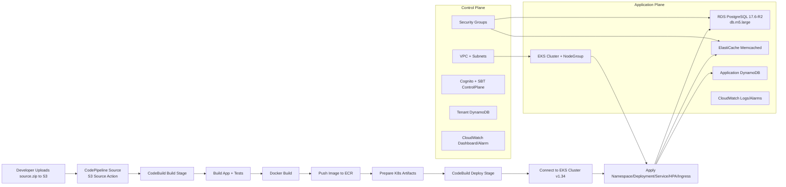

```mermaid
flowchart LR
  A[Developer Uploads source.zip to S3] --> B[CodePipeline Source<br/>S3 Source Action]
  B --> C[CodeBuild Build Stage]
  C --> D[Build App + Tests]
  D --> E[Docker Build]
  E --> F[Push Image to ECR]
  F --> G[Prepare K8s Artifacts]

  G --> H[CodeBuild Deploy Stage]
  H --> I[Connect to EKS Cluster v1.34]
  I --> J[Apply Namespace/Deployment/Service/HPA/Ingress]

  subgraph Control Plane
    CP1[VPC + Subnets]
    CP2[Security Groups]
    CP3[Cognito + SBT ControlPlane]
    CP4[Tenant DynamoDB]
    CP5[CloudWatch Dashboard/Alarm]
  end

  subgraph Application Plane
    AP1[EKS Cluster + NodeGroup]
    AP2[RDS PostgreSQL 17.6-R2<br/>db.m5.large]
    AP3[ElastiCache Memcached]
    AP4[Application DynamoDB]
    AP5[CloudWatch Logs/Alarms]
  end

  CP1 --> AP1
  CP2 --> AP2
  CP2 --> AP3
  AP1 --> J
  J --> AP2
  J --> AP3
  J --> AP4

```
