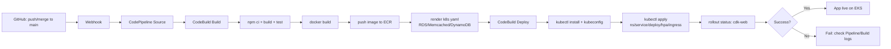

## CI/CD Flow (Compact + Detailed)



## Pipeline Source Update (GitHub Webhook)

This repo now uses a GitHub webhook-triggered source action for CodePipeline.

Trigger behavior:
- Pipeline starts on push to the configured branch.
- If PR is merged into `main`, that merge push to `main` triggers the pipeline.

Step-by-step code changes:

1. Update pipeline props in `packages/tms-infra-aws/lib/cicd-pipeline-stack.ts`.
```ts
export interface SbtCiCdPipelineStackProps extends cdk.StackProps {
  readonly eksClusterName: string;
  readonly eksDeployRoleArn: string;
  readonly postgresEndpointAddress: string;
  readonly memcachedConfigurationEndpoint: string;
  readonly applicationDataTableName: string;
  readonly githubOwner: string;
  readonly githubRepo: string;
  readonly githubBranch: string;
  readonly githubOauthTokenSecretName: string;
}
```

2. Change source action to GitHub webhook in `packages/tms-infra-aws/lib/cicd-pipeline-stack.ts`.
```ts
const sourceOutput = new codepipeline.Artifact('SourceArtifact');
const buildOutput = new codepipeline.Artifact('BuildArtifact');
const githubOauthToken = cdk.SecretValue.secretsManager(props.githubOauthTokenSecretName);

const pipeline = new codepipeline.Pipeline(this, 'DevEnterpriseCodePipeline', {
  pipelineType: codepipeline.PipelineType.V1,
  crossAccountKeys: false,
  artifactBucket,
});

pipeline.addStage({
  stageName: 'Source',
  actions: [
    new actions.GitHubSourceAction({
      actionName: 'GitHubSource',
      owner: props.githubOwner,
      repo: props.githubRepo,
      branch: props.githubBranch,
      oauthToken: githubOauthToken,
      output: sourceOutput,
      trigger: actions.GitHubTrigger.WEBHOOK,
    }),
  ],
});
```

3. Update app context wiring in `packages/tms-infra-aws/bin/sbt-toolkit.ts`.
```ts
const githubOwner = app.node.tryGetContext('githubOwner') ?? 'rahultiple31';
const githubRepo = app.node.tryGetContext('githubRepo') ?? 'med-aws-repo';
const githubBranch = app.node.tryGetContext('githubBranch') ?? 'main';
const githubOauthTokenSecretName = app.node.tryGetContext('githubOauthTokenSecretName');
if (!githubOauthTokenSecretName) {
  throw new Error(
    'Missing githubOauthTokenSecretName. Pass "-c githubOauthTokenSecretName=<secrets-manager-secret-name>".'
  );
}

const cicdPipelineStack = new SbtCiCdPipelineStack(app, 'DevCiCdPipelineStack', {
  env,
  eksClusterName: applicationPlaneStack.cluster.clusterName,
  eksDeployRoleArn: applicationPlaneStack.eksDeploymentRole.roleArn,
  postgresEndpointAddress: applicationPlaneStack.postgresDatabase.dbInstanceEndpointAddress,
  memcachedConfigurationEndpoint: `${applicationPlaneStack.memcachedCluster.attrConfigurationEndpointAddress}:${applicationPlaneStack.memcachedCluster.attrConfigurationEndpointPort}`,
  applicationDataTableName: applicationPlaneStack.applicationDataTable.tableName,
  githubOwner,
  githubRepo,
  githubBranch,
  githubOauthTokenSecretName,
});
```

4. Create GitHub PAT in AWS Secrets Manager.
- Secret value should be the GitHub Personal Access Token.
- Minimum scopes: `repo`, `admin:repo_hook`.
- Example secret name: `github/pat/med-aws-repo`.

5. Deploy stack with required context.
```powershell
cd C:\DevOps\med-aws-repo\packages\tms-infra-aws
npm run cdk -- deploy DevCiCdPipelineStack `
  -c systemAdminEmail=you@example.com `
  -c githubOwner=rahultiple31 `
  -c githubRepo=med-aws-repo `
  -c githubBranch=main `
  -c githubOauthTokenSecretName=github/pat/med-aws-repo
```

6. Verify trigger and execution.
- Push commit to `main` or merge PR into `main`.
- CodePipeline should start automatically.
- You can still trigger manually:
```powershell
aws codepipeline start-pipeline-execution --name <CodePipelineName> --region ca-central-1
```


## policy
Policy name: sbt-cdk.json
```
{
    "Version": "2012-10-17",
    "Statement": [
        {
            "Sid": "AssumeCdkBootstrapRoles",
            "Effect": "Allow",
            "Action": "sts:AssumeRole",
            "Resource": [
                "arn:aws:iam::056732011422:role/cdk-gha659fds-deploy-role-056732011422-ca-central-1",
                "arn:aws:iam::056732011422:role/cdk-gha659fds-file-publishing-role-056732011422-ca-central-1",
                "arn:aws:iam::056732011422:role/cdk-gha659fds-image-publishing-role-056732011422-ca-central-1",
                "arn:aws:iam::056732011422:role/cdk-gha659fds-lookup-role-056732011422-ca-central-1"
            ]
        },
        {
            "Sid": "ReadCdkBootstrapMetadata",
            "Effect": "Allow",
            "Action": [
                "ssm:GetParameter",
                "cloudformation:DescribeStacks",
                "cloudformation:ListStackResources"
            ],
            "Resource": [
                "arn:aws:ssm:ca-central-1:056732011422:parameter/cdk-bootstrap/gha659fds/version",
                "arn:aws:cloudformation:ca-central-1:056732011422:stack/CDKToolkit/*"
            ]
        },
        {
            "Sid": "CloudFormationDeployAccess",
            "Effect": "Allow",
            "Action": [
                "cloudformation:CreateStack",
                "cloudformation:UpdateStack",
                "cloudformation:DeleteStack",
                "cloudformation:CreateChangeSet",
                "cloudformation:DeleteChangeSet",
                "cloudformation:ExecuteChangeSet",
                "cloudformation:SetStackPolicy",
                "cloudformation:ValidateTemplate",
                "cloudformation:Describe*",
                "cloudformation:Get*",
                "cloudformation:List*",
                "cloudformation:TagResource",
                "cloudformation:UntagResource"
            ],
            "Resource": "*"
        },
        {
            "Sid": "IamForCdkAndWorkloadsNoPassRole",
            "Effect": "Allow",
            "Action": [
                "iam:CreateRole",
                "iam:DeleteRole",
                "iam:GetRole",
                "iam:UpdateRole",
                "iam:UpdateAssumeRolePolicy",
                "iam:TagRole",
                "iam:UntagRole",
                "iam:PutRolePolicy",
                "iam:DeleteRolePolicy",
                "iam:GetRolePolicy",
                "iam:ListRolePolicies",
                "iam:AttachRolePolicy",
                "iam:DetachRolePolicy",
                "iam:ListAttachedRolePolicies",
                "iam:CreatePolicy",
                "iam:DeletePolicy",
                "iam:GetPolicy",
                "iam:GetPolicyVersion",
                "iam:ListPolicyVersions",
                "iam:CreatePolicyVersion",
                "iam:DeletePolicyVersion",
                "iam:TagPolicy",
                "iam:UntagPolicy",
                "iam:CreateInstanceProfile",
                "iam:DeleteInstanceProfile",
                "iam:AddRoleToInstanceProfile",
                "iam:RemoveRoleFromInstanceProfile",
                "iam:GetInstanceProfile",
                "iam:TagInstanceProfile",
                "iam:UntagInstanceProfile",
                "iam:ListInstanceProfilesForRole",
                "iam:CreateServiceLinkedRole"
            ],
            "Resource": "*"
        },
        {
            "Sid": "PassRoleRestricted",
            "Effect": "Allow",
            "Action": "iam:PassRole",
            "Resource": [
                "arn:aws:iam::056732011422:role/cdk-gha659fds-*",
                "arn:aws:iam::056732011422:role/Dev*",
                "arn:aws:iam::056732011422:role/*CodeBuild*",
                "arn:aws:iam::056732011422:role/*CodePipeline*",
                "arn:aws:iam::056732011422:role/*Eks*",
                "arn:aws:iam::056732011422:role/*Nodegroup*",
                "arn:aws:iam::056732011422:role/*Lambda*"
            ],
            "Condition": {
                "StringEquals": {
                    "iam:PassedToService": [
                        "cloudformation.amazonaws.com",
                        "codebuild.amazonaws.com",
                        "codepipeline.amazonaws.com",
                        "eks.amazonaws.com",
                        "ec2.amazonaws.com",
                        "lambda.amazonaws.com"
                    ]
                }
            }
        },
        {
            "Sid": "ApplicationAndPlatformServices",
            "Effect": "Allow",
            "Action": [
                "ec2:*",
                "eks:*",
                "autoscaling:*",
                "elasticloadbalancing:*",
                "rds:*",
                "elasticache:*",
                "dynamodb:*",
                "secretsmanager:*",
                "cognito-idp:*",
                "events:*",
                "apigateway:*",
                "lambda:*",
                "kms:*",
                "ssm:*",
                "logs:*",
                "cloudwatch:*",
                "tag:*"
            ],
            "Resource": "*"
        },
        {
            "Sid": "CicdAndContainerServices",
            "Effect": "Allow",
            "Action": [
                "s3:*",
                "ecr:*",
                "codebuild:*",
                "codepipeline:*"
            ],
            "Resource": "*"
        },
        {
            "Sid": "CallerIdentity",
            "Effect": "Allow",
            "Action": "sts:GetCallerIdentity",
            "Resource": "*"
        }
    ]
}
```

## trust policy
Trust policy name: sbt-cdk-trust.json

```
{
    "Version": "2012-10-17",
    "Statement": [
        {
            "Sid": "GitHubOidcTrust",
            "Effect": "Allow",
            "Principal": {
                "Federated": "arn:aws:iam::056732011422:oidc-provider/token.actions.githubusercontent.com"
            },
            "Action": "sts:AssumeRoleWithWebIdentity",
            "Condition": {
                "StringEquals": {
                    "token.actions.githubusercontent.com:aud": "sts.amazonaws.com"
                },
                "StringLike": {
                    "token.actions.githubusercontent.com:sub": [
                        "repo:rahultiple31/med-aws-repo:ref:refs/heads/main",
                        "repo:rahultiple31/med-aws-repo:ref:refs/heads/*",
                        "repo:rahultiple31/med-aws-repo:pull_request",
                        "repo:rahultiple31/med-aws-repo:environment:*"
                    ]
                }
            }
        }
    ]
}
```


## Create role trust policy: dev-local-role-trust.json

Policy document file: dev-local-role-trust.json

```
{
  "Version": "2012-10-17",
  "Statement": [
    {
      "Sid": "TrustRahulUser",
      "Effect": "Allow",
      "Principal": {
        "AWS": "arn:aws:iam::056732011422:user/rahul"
      },
      "Action": "sts:AssumeRole"
    }
  ]
}

```


## Create Rahul user policy (assume role only): rahul-assume-dev-local-role-policy.json

Policy name: rahul-assume-dev-local-role-policy.json

```
{
  "Version": "2012-10-17",
  "Statement": [
    {
      "Sid": "AssumeDevLocalDeployRole",
      "Effect": "Allow",
      "Action": "sts:AssumeRole",
      "Resource": "arn:aws:iam::056732011422:role/DevLocalDeployRole"
    },
    {
      "Sid": "GetCallerIdentity",
      "Effect": "Allow",
      "Action": "sts:GetCallerIdentity",
      "Resource": "*"
    }
  ]
}

```
