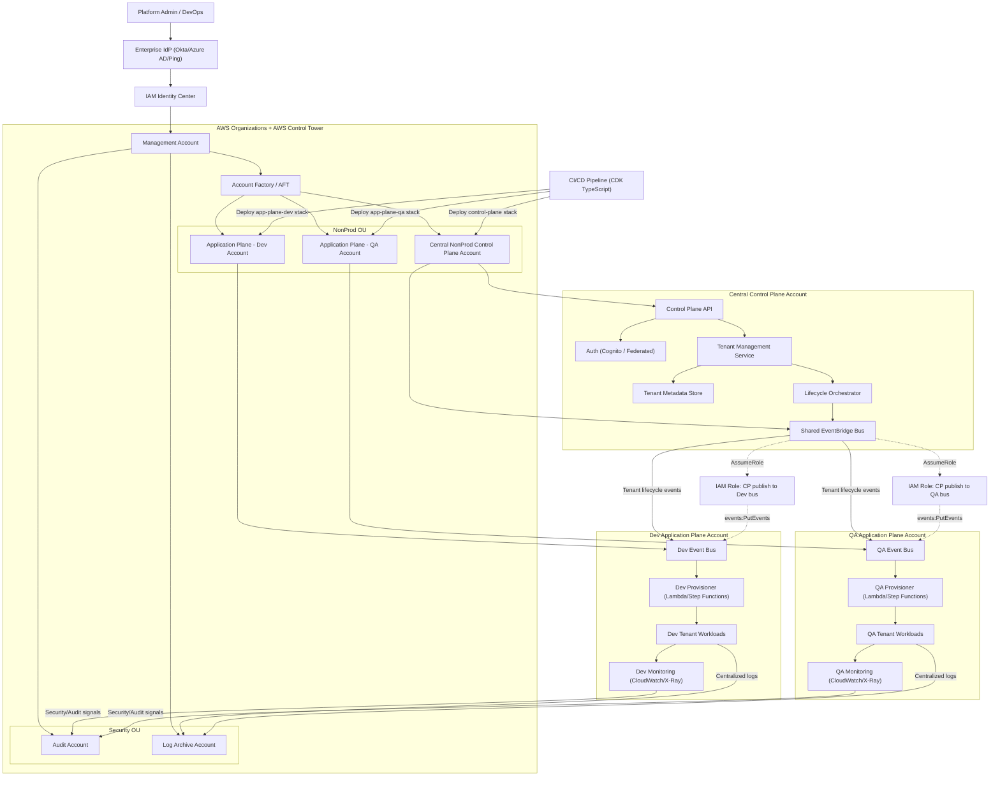

                               +----------------------------------+
                               |  Management (Root) Account       |
                               +----------------+-----------------+
                                                |
                                                v
                               +----------------------------------+
                               | AWS Control Tower Landing Zone   |
                               +----------------+-----------------+
                                                |
        +---------------------------------------+--------------------------------------+
        |                                      |                                      |
        v                                      v                                      v
+-------------------------+        +-------------------------+            +-------------------------+
| Security OU             |        | Platform OU             |            | Application OU          |
+-----------+-------------+        +-----------+-------------+            +-----------+-------------+
            |                                  |                                      |
     +------+-------+                  +-------+----------------+             +-------+-------+
     | Log Archive  |                  | SaaS Control Plane     |             | Dev Account   |
     | Account      |                  | Account                |             | (App Plane)   |
     +--------------+                  +-----------+------------+             +-------+-------+
            |                                      |                                  |
     +------+-------+                              |                                  |
     | Audit        |                              |                                  |
     | Account      |                              |                                  |
     +--------------+                              |                           +------+-------+
                                                   |                           | QA Account    |
                                                   |                           | (App Plane)   |
                                                   |                           +--------------+
                                                   |
                                                   v
                                Tenant onboarding / identity / metering / provisioning
                                                   |
                                   +---------------+----------------+
                                   |                                |
                                   v                                v
                           Dev Application Plane            QA Application Plane

Cross-account governance/data flow:
- Dev, QA, and Control Plane logs/compliance data -> Log Archive
- Audit account has read-only audit/security visibility into Control Plane, Dev, QA
- Dev and QA send provisioning/status events back to SaaS Control Plane

---------------------------------------------------------------------------------------------------

